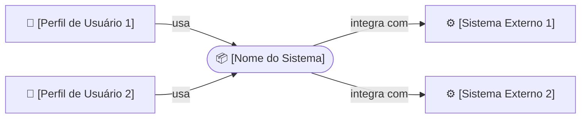
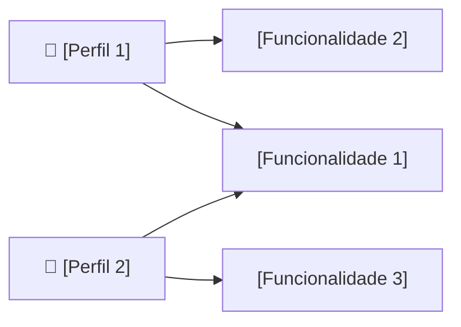
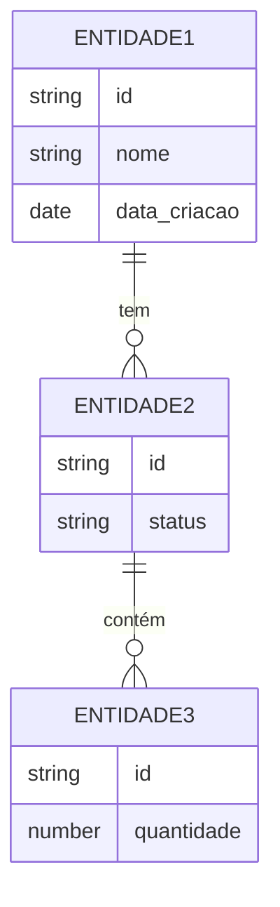

# Catálogo: Modelagem Visual — Templates Mermaid

Usado pela skill **`modelagem-visual`** para gerar diagramas consistentes entre
projetos. Cada template é canônico — a skill substitui os placeholders com dados
reais dos artefatos de entrada.

Motor: Mermaid (render nativo GitHub/VSCode, sem runtime extra)

---

## Regras de rotulagem leigo-safe

As regras a seguir valem para **todos** os rótulos de nós no subconjunto leigo
(context, use-case, fluxo). Aplicar `traducao-leigo` sobre os rótulos gerados.

| Proibido nos rótulos leigo | Substituir por |
|---|---|
| Termos da blacklist D1 (requisito, elicitação, stakeholder…) | Equivalentes da blacklist |
| Nomes de entidades técnicas (ex: `UserEntity`) | Nome de negócio (ex: "Cliente") |
| Acrônimos não expandidos (ex: `API`, `BD`) | Nome legível (ex: "Serviço de Pagamento", "Banco de Dados") |
| Verbos técnicos (ex: "autenticar", "serializar") | Verbos de negócio (ex: "entrar no sistema", "salvar") |

---

## 1. Diagrama de Contexto (obrigatório — sempre gerar)

**Perspectiva:** ISO 29148 / fronteira do sistema
**Leigo-safe:** ✅ sim
**Fonte:** `documentos-tecnicos/01-visao/01-visao-produto.md` — seção Contexto e
Limites (integrações, atores principais) + `02.3-restricoes.md` (sistemas externos)

**Algoritmo:**
1. Extrair o nome do sistema/produto
2. Extrair perfis de usuário (camada 1 do onion)
3. Extrair integrações externas (sistemas, serviços, APIs terceiras)
4. Montar flowchart LR com: atores à esquerda, sistema no centro, externos à direita



**Regras:**
- Se não há integração externa → omitir nós externos (não criar nó vazio)
- Máximo 4 atores e 4 externos — agrupar se ultrapassar
- Rótulos das setas em linguagem de negócio (não "POST /api/…")

---

## 2. Diagrama de Caso de Uso — "Mapa de Funcionalidades" (obrigatório)

**Perspectiva:** ISO 29148 use cases / funcional
**Leigo-safe:** ✅ sim (mostrar como "o que o sistema faz para cada pessoa")
**Fonte:** `documentos-tecnicos/02-requisitos/02.1-requisitos-funcionais.md` (RFs DEVE)
× stakeholders da camada 1 do onion

**Algoritmo:**
1. Agrupar RFs DEVE por ator principal (quem executa ou inicia a ação)
2. Para cada ator: criar nó de ator + nós de funcionalidade vinculados



**Regras:**
- Máximo 8 funcionalidades por diagrama — se ultrapassar, agrupar por módulo
  (usar `subgraph`) ou recortar pelo ator
- Usar descrição do RF sem sintaxe EARS ("Cadastrar produto" não "O sistema DEVE permitir o cadastro de produto")
- Se RF não tem ator claro → mapear para o ator de maior influência no onion

---

## 3. Diagrama Entidade-Relacionamento (técnico — não leigo)

**Perspectiva:** IREB estrutural/dados
**Leigo-safe:** ❌ (versão técnica apenas)
**Fonte:** `documentos-tecnicos/02-requisitos/02.5-glossario.md` (entidades e suas
definições + relações mencionadas)

**Algoritmo:**
1. Extrair substantivos do glossário que representem "coisas que o sistema armazena"
   (ex: "Pedido", "Cliente", "Produto", "Pagamento")
2. Inferir atributos principais do contexto (id, nome, data, status são seguros)
3. Inferir relações das definições e dos RFs (ex: "Pedido contém vários Itens")
4. Usar notação crow's foot



**Regras:**
- Nomear entidades em MAIÚSCULAS (convenção erDiagram)
- Inferência conservadora: incluir só entidades com ≥ 2 atributos identificáveis
- Se glossário tem < 3 termos substantivos → não gerar ER; registrar nota explicando
- Relações: inferir dos RFs e definições — nunca inventar

---

---

## 4. Subconjunto leigo-safe — o que vai para traducao-gate

O arquivo `03.3-diagramas.md` contém uma seção marcada que `traducao-gate`
extrai para embutir no doc leigo (2 diagramas: contexto e caso de uso):

```markdown
<!-- LEIGO-SAFE-START -->
## Como o produto funciona

### Quem usa e o que o produto faz

[diagrama de contexto aqui]

### O que cada pessoa pode fazer

[diagrama de caso de uso aqui]
<!-- LEIGO-SAFE-END -->
```

`traducao-leigo` deve ser aplicado sobre os rótulos dos nós antes de embutir
no doc leigo — os títulos de seção também devem seguir a blacklist D1.
